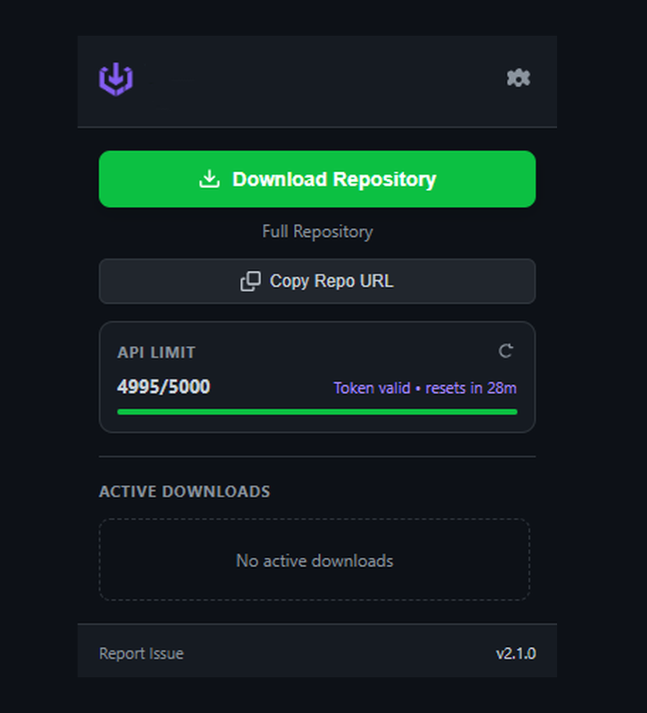
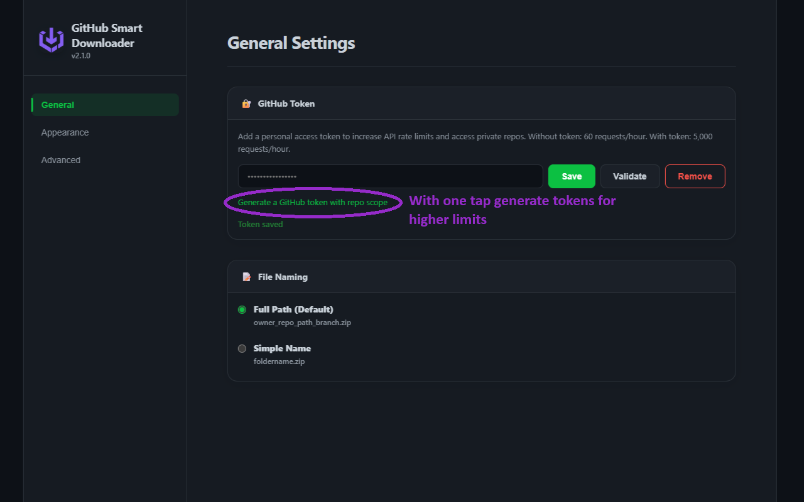
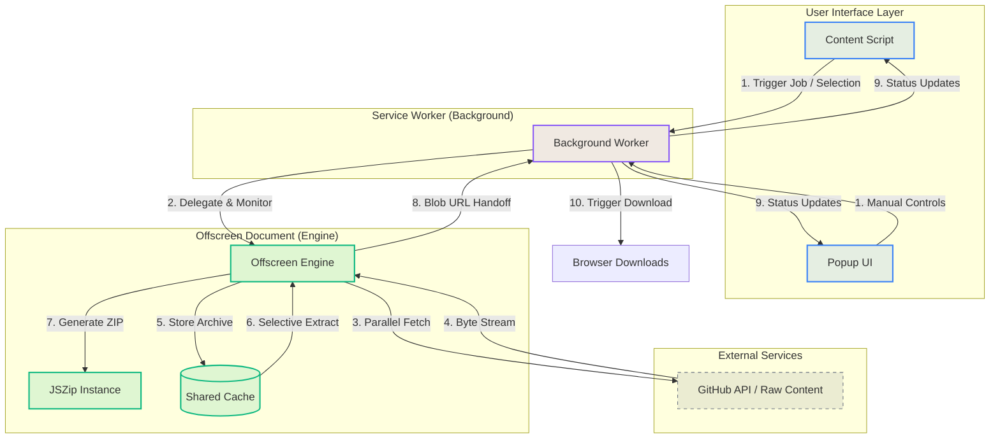

  

  # GitHub Smart Downloader

  **GitHub Smart Downloader** is a Manifest V3 Chrome extension for downloading GitHub repositories, folders, or selected files as ZIP archives directly from the browser. It supports full repository downloads, folder-level downloads, selected file/folder packaging, GitHub token-based API access, and progress tracking.

---

## 🚀 Repository Interaction

### 📸 Visual Showcase

  <table style="border-collapse: collapse; border: none;">
    <tr>
      <td width="50%" style="border: none; padding: 10px;">
        
<strong>Download Jobs</strong>

        
      </td>
      <td width="50%" style="border: none; padding: 10px;">
        
<strong>Settings & Customization</strong>

        
      </td>
    </tr>
  </table>

---

## ✨ Key Features

- **Granular Selection**: Download individual files, specific directories, or entire repositories.
- **Offscreen Processing**: Utilizes a dedicated Manifest V3 offscreen document for ZIP generation and background operations.
- **Shared Archive Cache**: Reuses repository archives across concurrent jobs to reduce duplicate API calls and network overhead.
- **Selective ZIP Extraction**: Packages selected files or folders from cached repository data without re-scanning the GitHub API.
- **Real-time Monitoring**: Track progress for multiple concurrent jobs through a clean, native-feeling dashboard.
- **Theme Support**: Fully compatible with GitHub's Light and Dark modes with customizable accent colors.
- **Rate Limit Management**: Built-in support for Personal Access Tokens (PAT) to handle large repository structures.

---

## 🏗️ Architecture

GitHub Smart Downloader uses a multi-context architecture to maximize performance and ensure stability within the constraints of Manifest V3.

---

## 🛠️ Installation & Setup

<b>Standard Installation (Unpacked)</b>

1.  **Clone this repository**: `git clone https://github.com/sserdardundar/GitHub Smart Downloader.git`
2.  **Open Chrome Extensions**: Navigate to `chrome://extensions/`.
3.  **Enable Developer Mode**: Toggle the switch in the top right.
4.  **Load Unpacked**: Click "Load unpacked" and select the root directory of this project.

<b>Developer Guide</b>

For detailed development setup and architectural details, please refer to the **[Usage Guide](docs/USAGE.md)** and **[Architecture Overview](docs/ARCHITECTURE.md)**.

---

## ⚠️ Limitations

- **Memory Limits**: Extremely large repositories may exceed browser memory limits during ZIP generation.
- **Rate Limits**: GitHub API rate limits apply (60/hr without a token, 5,000/hr with a token).
- **Private Repositories**: Accessing private repositories requires a GitHub Personal Access Token with read access to the target repository.
- **DOM Dependencies**: Significant changes to the GitHub UI may require extension updates.

---

## 🔒 Security & Privacy

- **Encrypted Storage**: GitHub Personal Access Tokens are encrypted before being stored in Chrome extension storage. The extension does not send tokens to any third-party backend.
- **Local-Only Processing**: Your tokens and downloaded data are processed exclusively within your browser; no data is sent to external servers other than official GitHub endpoints.
- **Secure Communication**: All API interactions are performed via official HTTPS GitHub endpoints.

---

  Licensed under the MIT License. Built with 🔨⚙️ by <a href="https://github.com/sserdardundar">sserdardundar</a>.
   
  GitHub Smart Downloader is not affiliated with, maintained, authorized, endorsed, or sponsored by GitHub or its affiliates.

